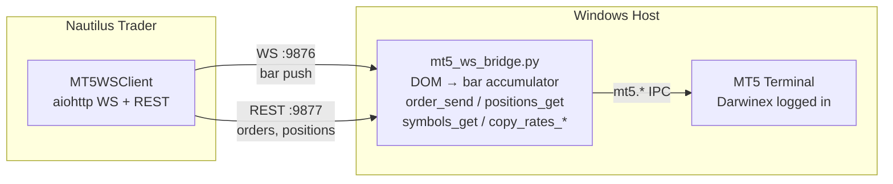

# MT5 Bridge

Connects any MetaTrader 5 terminal to your algo trading system across Windows and WSL2. Runs where the MT5 terminal lives.

Two transports instead of one: WebSocket pushes completed OHLCV bars from DOM mid-price in real time; HTTP REST handles orders, positions, and account queries. No polling, no MCP overhead — wire it straight into your algo trading system.

### Pain points solved

| Problem | How this project helps |
|---|---|
| MT5 lives on Windows, your algo stack on Linux/WSL2 | Cross-platform bridge over WS + REST — no need to run Python bots on Windows |
| Single-transport connectors force polling | Dual transport: WebSocket pushes real-time data, REST handles request/reply |
| Tick-level DOM noise overwhelms strategies | `BarAccumulator` produces clean OHLCV bars from DOM mid-price at configurable timeframes |
| Reconnect loses data | Replays last completed bar per (symbol, timeframe) after reconnect — no gaps |
| Bridges lack built-in auth | Optional API key on both transports (Bearer header / WS first-message). Production-safe |
| Every client needs its own SDK | Standard WebSocket + HTTP REST — `curl`, Python, JS, anything that speaks HTTP or WS

## Architecture



**Two transports:**

| Transport | Port | Purpose |
|---|---|---|
| WebSocket | 9876 | Push: completed OHLCV bars from DOM mid-price |
| HTTP REST | 9877 | Request/response: orders, positions, symbols, history |

## Quick Start

### Prerequisites

- Windows 11
- MT5 Terminal (Darwinex) running and logged in
- Python 3.10+ with `MetaTrader5` package installed
- **Automated Trading enabled**: MT5 → Tools → Options → Expert Advisors → check "Allow Automated Trading"

### Install

```powershell
cd bridge
pip install -r requirements.txt
```

### Run

```powershell
# Auto-detect MT5 terminal (connects to already-running instance)
python mt5_ws_bridge.py

# Or specify explicit path
python mt5_ws_bridge.py --mt5-path "C:\Program Files\Darwinex MetaTrader 5\terminal64.exe"

# Require API key auth (recommended for production)
set MT5_API_KEY=my-secret-key
python mt5_ws_bridge.py --api-key %MT5_API_KEY%
```

The bridge logs:
```
08:14:20 [INFO] mt5-bridge: MT5: Darwinex MetaTrader 5 build=5833
08:14:20 [INFO] mt5-bridge: Account: AccountInfo(login=3000100276, ...)
08:14:20 [INFO] mt5-bridge: Bridge: WS :9876/ws, REST :9877/rpc
```

### Run Tests

Keep the bridge running in one terminal, then:

```powershell
python -m pytest tests/ -v
```

Expected output:
```
13 passed in 3.20s
```

## API Key Authentication

Both transports require authentication when `--api-key` or `MT5_API_KEY` env var is set. If no key is configured, access is open (backward compatible for local dev).

### REST: `Authorization: Bearer` header

```python
headers = {
    "Content-Type": "application/json",
    "Authorization": "Bearer my-secret-key",
}
```

### WebSocket: `{"type": "auth"}` as first message

The first message after connecting MUST be:

```json
{"type": "auth", "api_key": "my-secret-key"}
```

If auth fails, the bridge replies `{"type": "error", "message": "invalid api_key"}` and closes the connection with code 4001.

## REST API

All calls: `POST http://127.0.0.1:9877/rpc` with `{"method": "...", "params": {...}}`

If an API key is required, include `Authorization: Bearer <key>`.

### Account & Info

| Method | Returns |
|---|---|
| `account_info` | Balance, equity, login, server, currency |
| `terminal_info` | MT5 build, data path, company |
| `symbols_get` | All 853 symbols with bid/ask/spread |
| `symbol_info` | Single symbol details |

### Market Data

| Method | Params | Returns |
|---|---|---|
| `copy_rates_range` | `symbol, timeframe, date_from, date_to` | OHLCV bars as list of dicts |
| `copy_rates_from_pos` | `symbol, timeframe, start_pos, count` | Last N bars |
| `market_book_add` | `symbol` | Subscribe to DOM |
| `market_book_get` | `symbol` | DOM levels (bid/ask/volume) |
| `market_book_release` | `symbol` | Unsubscribe from DOM |

Timeframes: `1` (M1), `5` (M5), `15` (M15), `30` (M30), `16385` (H1), `16388` (H4), `16392` (D1)

### Trading

| Method | Params | Returns |
|---|---|---|
| `order_send` | `request` dict | `retcode`, `order`, `price`, `deal` |
| `orders_get` | optional `symbol` | Open orders |
| `positions_get` | optional `symbol` | Open positions |
| `history_deals_get` | `date_from, date_to` | Deal history |
| `history_orders_get` | `date_from, date_to` | Order history |

### Constants

`MetaTrader5` Python package cannot be installed on Linux/WSL. Callers running outside Windows can `import` the constants from this repo's [`constants.py`](constants.py) instead:

```python
from constants import (
    TRADE_ACTION_DEAL, TRADE_ACTION_PENDING, TRADE_ACTION_REMOVE,
    ORDER_TYPE_BUY, ORDER_TYPE_SELL, ORDER_TYPE_BUY_LIMIT,
    ORDER_TIME_GTC, ORDER_FILLING_IOC, ORDER_FILLING_RETURN,
    TRADE_RETCODE_DONE,
)

# Market BUY
order_send({
    "action": TRADE_ACTION_DEAL,
    "type": ORDER_TYPE_BUY,
    "symbol": "EURUSD", "volume": 0.01,
    "price": 0.0, "deviation": 10, "magic": 123456,
    "type_time": ORDER_TIME_GTC,
    "type_filling": ORDER_FILLING_IOC,
})

# Cancel pending order
order_send({"action": TRADE_ACTION_REMOVE, "order": ticket})
```

> ⚠️ `TRADE_ACTION_REMOVE` = `8` (not `6`). See [`constants.py`](constants.py) for the full list of 223 constants.
>
> Regenerate with: `python scripts/dump_mt5_constants.py --py` (Windows only).

### Example: Place + Close

```python
import json, urllib.request

API_KEY = ""  # set if bridge requires auth
H = {"Content-Type": "application/json"}
if API_KEY: H["Authorization"] = f"Bearer {API_KEY}"

def rpc(method, params=None):
    req = urllib.request.Request("http://127.0.0.1:9877/rpc",
        data=json.dumps({"method": method, "params": params or {}}).encode(),
        headers=H)
    return json.loads(urllib.request.urlopen(req, timeout=10).read())

# Place BUY
result = rpc("order_send", {"request": {
    "action": 1, "symbol": "EURUSD", "volume": 0.01, "type": 0,
    "price": 0.0, "deviation": 10, "magic": 123456,
    "comment": "test", "type_time": 0, "type_filling": 1,
}})
print(f"Retcode: {result['result']['retcode']}")  # 10009 = DONE

# Close
ticket = result["result"]["order"]
close = rpc("order_send", {"request": {
    "action": 1, "symbol": "EURUSD", "volume": 0.01, "type": 1,
    "position": ticket, "price": 0.0, "deviation": 10,
    "magic": 123456, "comment": "close", "type_time": 0, "type_filling": 1,
}})
```

## WebSocket API

Connect to `ws://127.0.0.1:9876/ws`

### Authenticate

```json
{"type": "auth", "api_key": "my-secret-key"}
```

Send this as your **first** message. If the bridge has no API key configured, any value works (including empty string).

### Subscribe

```json
{"type": "subscribe", "symbol": "EURUSD", "timeframes": [60, 300]}
```

Timeframes in seconds: `60` (M1), `300` (M5), `3600` (H1)

### Bar Push

```json
{"type": "bars", "data": [{
    "symbol": "EURUSD",
    "timeframe_secs": 60,
    "open": 1.16989,
    "high": 1.16992,
    "low": 1.16959,
    "close": 1.16973,
    "volume": 3319695000,
    "tick_count": 142,
    "ts_open_ns": 1777980420000000000,
    "ts_close_ns": 1777980480000000000
}]}
```

### Unsubscribe

```json
{"type": "unsubscribe", "symbol": "EURUSD"}
```

### Ping/Pong

```json
{"type": "ping"}  →  {"type": "pong"}
```

### Reconnection

On reconnect, the bridge replays the last completed bar per (symbol, timeframe) after auth. No bars are missed.

## DOM Data

Bars are built from the **mid-price** of best bid/ask in the Depth of Market. The bridge polls `market_book_get()` at 50ms intervals and accumulates into OHLCV bars.

DOM types use `mt5.BOOK_TYPE_BUY` (bid) and `mt5.BOOK_TYPE_SELL` (ask) directly — no hardcoded constants needed.

## Serialization

MT5 return objects are converted to plain Python via `to_python()`:

| Source Type | Method |
|---|---|
| `np.ndarray` (copy_rates_*) | `pd.DataFrame().to_dict(orient='records')` |
| Namedtuple/structseq (has `_asdict`) | Recursive `_asdict()` (handles nested like `OrderSendResult` → `TradeRequest`) |
| tuple/list | Recursive per element |
| None/primitives | Pass through |

## Files

```
bridge/
├── mt5_ws_bridge.py    # Production bridge (512 lines)
├── requirements.txt    # MetaTrader5, aiohttp, orjson, pandas, numpy
├── tests/
│   ├── conftest.py     # Shared fixtures (rpc helper, auth headers)
│   ├── test_bridge_live.py  # 6 REST smoke tests
│   ├── test_dom.py         # 2 DOM tests (via bridge REST)
│   ├── test_order.py       # 2 order round-trip tests
│   └── test_ws_client.py   # 3 WS push tests
└── README.md
```
