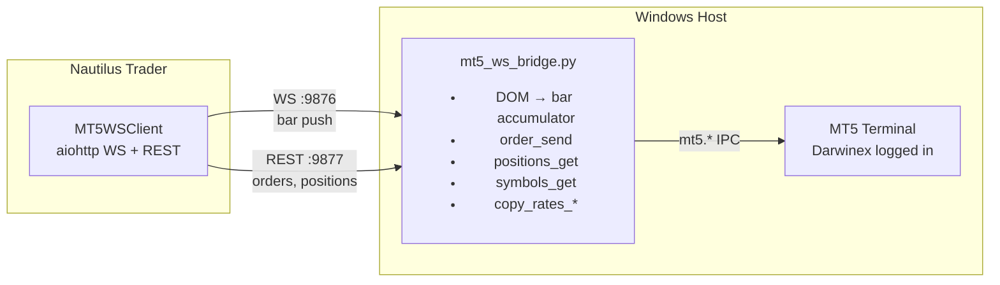

# MT5 Bridge

Connects MetaTrader 5 (Darwinex) to Nautilus Trader on WSL2. Runs on Windows where MT5 terminal lives.

## Architecture

```

```

**Two transports:**

| Transport | Port | Purpose |
|---|---|---|
| WebSocket | 9876 | Push: completed OHLCV bars from DOM mid-price |
| HTTP REST | 9877 | Request/response: orders, positions, symbols, history |

## Quick Start

### Prerequisites

- Windows 11
- MT5 Terminal (Darwinex) running and logged in
- Python 3.10+ with `MetaTrader5` package installed
- **Automated Trading enabled**: MT5 → Tools → Options → Expert Advisors → check "Allow Automated Trading"

### Install

```powershell
cd bridge
pip install -r requirements.txt
```

### Run

```powershell
# Auto-detect MT5 terminal (connects to already-running instance)
python mt5_ws_bridge.py

# Or specify explicit path
python mt5_ws_bridge.py --mt5-path "C:\Program Files\Darwinex MetaTrader 5\terminal64.exe"
```

The bridge logs:
```
21:53:04 [INFO] mt5-bridge: MT5: Darwinex MetaTrader 5 build=5833
21:53:04 [INFO] mt5-bridge: Account: AccountInfo(login=3000100276, ...)
21:53:04 [INFO] mt5-bridge: Bridge: WS :9876/ws, REST :9877/rpc
```

### Run Tests

Keep the bridge running in one terminal, then:

```powershell
python -m pytest tests/ -v
```

Expected output:
```
13 passed in 3.20s
```

## REST API

All calls: `POST http://127.0.0.1:9877/rpc` with `{"method": "...", "params": {...}}`

### Account & Info

| Method | Returns |
|---|---|
| `account_info` | Balance, equity, login, server, currency |
| `terminal_info` | MT5 build, data path, company |
| `symbols_get` | All 853 symbols with bid/ask/spread |
| `symbol_info` | Single symbol details |

### Market Data

| Method | Params | Returns |
|---|---|---|
| `copy_rates_range` | `symbol, timeframe, date_from, date_to` | OHLCV bars as list of dicts |
| `copy_rates_from_pos` | `symbol, timeframe, start_pos, count` | Last N bars |

Timeframes: `1` (M1), `5` (M5), `15` (M15), `30` (M30), `16385` (H1), `16388` (H4), `16392` (D1)

### Trading

| Method | Params | Returns |
|---|---|---|
| `order_send` | `request` dict (see below) | `retcode`, `order`, `price`, `deal` |
| `orders_get` | optional `symbol` | Open orders |
| `positions_get` | optional `symbol` | Open positions |
| `history_deals_get` | `date_from, date_to` | Deal history |
| `history_orders_get` | `date_from, date_to` | Order history |

### Example: Place + Close

```python
import json, urllib.request

def rpc(method, params=None):
    req = urllib.request.Request("http://127.0.0.1:9877/rpc",
        data=json.dumps({"method": method, "params": params or {}}).encode(),
        headers={"Content-Type": "application/json"})
    return json.loads(urllib.request.urlopen(req, timeout=10).read())

# Place BUY
result = rpc("order_send", {"request": {
    "action": 1, "symbol": "EURUSD", "volume": 0.01, "type": 0,
    "price": 0.0, "deviation": 10, "magic": 123456,
    "comment": "test", "type_time": 0, "type_filling": 1,
}})
print(f"Retcode: {result['result']['retcode']}")  # 10009 = DONE

# Close
ticket = result["result"]["order"]
close = rpc("order_send", {"request": {
    "action": 1, "symbol": "EURUSD", "volume": 0.01, "type": 1,
    "position": ticket, "price": 0.0, "deviation": 10,
    "magic": 123456, "comment": "close", "type_time": 0, "type_filling": 1,
}})
```

## WebSocket API

Connect to `ws://127.0.0.1:9876/ws`

### Subscribe

```json
{"type": "subscribe", "symbol": "EURUSD", "timeframes": [60, 300]}
```

Timeframes in seconds: `60` (M1), `300` (M5), `3600` (H1)

### Bar Push

```json
{"type": "bars", "data": [{
    "symbol": "EURUSD",
    "timeframe_secs": 60,
    "open": 1.16989,
    "high": 1.16992,
    "low": 1.16959,
    "close": 1.16973,
    "volume": 3319695000,
    "tick_count": 142,
    "ts_open_ns": 1777980420000000000,
    "ts_close_ns": 1777980480000000000
}]}
```

### Unsubscribe

```json
{"type": "unsubscribe", "symbol": "EURUSD"}
```

### Reconnection

On reconnect, the bridge replays the last completed bar per (symbol, timeframe). No bars are missed.

## DOM Data

Bars are built from the **mid-price** of best bid/ask in the Depth of Market. The bridge polls `market_book_get()` at 50ms intervals and accumulates into OHLCV bars.

**DOM type mapping (MQL5 standard):**

```
MQL5:  BOOK_TYPE_SELL=0 (Offer/ASK)  → mt5.BOOK_TYPE_SELL=1
       BOOK_TYPE_BUY=1  (Bid)        → mt5.BOOK_TYPE_BUY=2
```

Python `MetaTrader5` adds 1 to the MQL5 enum values.

## Serialization

MT5 return objects are converted to plain Python via `to_python()`:

| Source Type | Method |
|---|---|
| `np.ndarray` (copy_rates_*) | `pd.DataFrame().to_dict(orient='records')` |
| Namedtuple/structseq (has `_asdict`) | Recursive `_asdict()` (handles nested like `OrderSendResult` → `TradeRequest`) |
| tuple/list | Recursive per element |
| None/primitives | Pass through |

## Files

```
bridge/
├── mt5_ws_bridge.py    # Production bridge (512 lines)
├── requirements.txt    # MetaTrader5, aiohttp, orjson, pandas
├── tests/
│   ├── conftest.py     # Shared fixtures
│   ├── test_bridge_live.py  # REST endpoint tests (6)
│   ├── test_dom.py         # DOM subscription tests (2)
│   ├── test_order.py       # Order round-trip tests (2)
│   └── test_ws_client.py   # WS bar push tests (3)
└── README.md
```
